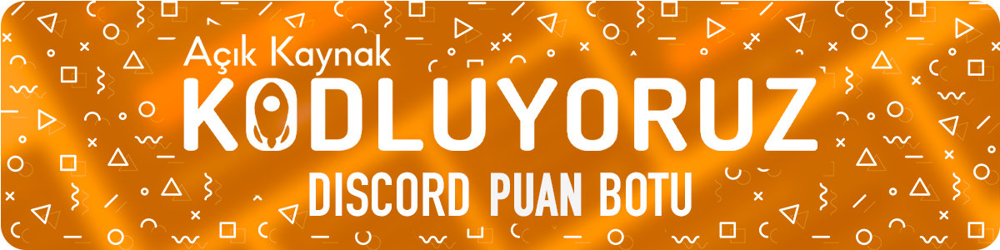

# Kodluyoruz Discord Puan Botu

#

#

## Proje Hakkında 📜

Kodluyoruz ekibi ve Kodluyoruz Açık Kaynak gönüllüleri tarafından hazırlanmış Discord puan botu, Discord sunucularında kullanılmak üzere özelleştirilebilir, kullanıcı dostu ve otomatik bir puanlama sistemi oluşturmaktır. Bu puanlama sistemi, sunucuda bulunan üyelerin etkinliklerdeki katılımlarını izlemek, aktif üyeleri ödüllendirmek ve topluluk deneyimini geliştirmeye yardımcı olan bir araçtır. Sunucu yöneticilerinin bu işlemlerdeki süreçlerini kolaylaştırmaya destek olacaktır.

## Başlarken 📌

### Gereksinimler

Lorem ipsum, dolor sit amet consectetur adipisicing elit. Officiis quos sit excepturi impedit beatae cum labore explicabo autem, nostrum quasi ab? Nobis et accusantium, ducimus nulla dolorum minima culpa fugit corporis alias nostrum corrupti beatae unde assumenda maiores odio reprehenderit necessitatibus. Voluptas maxime sit perspiciatis, inventore similique blanditiis suscipit. Deserunt.

### Kurulum

Lorem ipsum, dolor sit amet consectetur adipisicing elit. Officiis quos sit excepturi impedit beatae cum labore explicabo autem, nostrum quasi ab? Nobis et accusantium, ducimus nulla dolorum minima culpa fugit corporis alias nostrum corrupti beatae unde assumenda maiores odio reprehenderit necessitatibus. Voluptas maxime sit perspiciatis, inventore similique blanditiis suscipit. Deserunt.

### Versiyonlar

Lorem ipsum, dolor sit amet consectetur adipisicing elit. Officiis quos sit excepturi impedit beatae cum labore explicabo autem, nostrum quasi ab? Nobis et accusantium, ducimus nulla dolorum minima culpa fugit corporis alias nostrum corrupti beatae unde assumenda maiores odio reprehenderit necessitatibus.

(<a href="#readme-top"> yukarı çık </a>)

## Görseller 📷

(<a href="#readme-top"> yukarı çık </a>)

## İçerik Tablosu 📑

- [Kodluyoruz Discord Puan Botu](#kodluyoruz-discord-puan-botu)
- 
- 
  - [Proje Hakkında 📜](#proje-hakkında-)
  - [Başlarken 📌](#başlarken-)
    - [Gereksinimler](#gereksinimler)
    - [Kurulum](#kurulum)
    - [Versiyonlar](#versiyonlar)
  - [Görseller 📷](#görseller-)
  - [İçerik Tablosu 📑](#i̇çerik-tablosu-)
  - [Özellikler 🖥️](#özellikler-️)
  - [Katkı Sağlayanlar 👩‍💻](#katkı-sağlayanlar-)
  - [Davranış Kuralları 🎯](#davranış-kuralları-)
  - [Katkıda Bulunma 👨‍💻](#katkıda-bulunma-)
  - [Lisans ©](#lisans-)

(<a href="#readme-top"> yukarı çık </a>)

## Özellikler 🖥️

### Kullanıcı

- ⚡ **Bot Rehberi** - Nasıl puan kazanacağına dair özel ayarlanmış rehber ile sistem hakkında bilgi sahibi olunabilir.
- ⚡  **Kolayca Katılabilme** - Puan sistemine kolayca dahil olup, puan kazanmaya hızlıca başlanabilir.
- ⚡ **Puan Kazanma** - Mesaj atma, arkadaş davet etme, sesli kanalda bulunma gibi pek çok farklı eylem ile puan kazanabilirsiniz.
- ⚡ **Puan Durumu** - Özel tasarlanmış UI sayesinde kullanıcı anlık puan durumuna ve sıralamasına kolayca ulaşabilir.
- ⚡ **Kullanıcı Etkinliği** - Kullanıcı istatistik kartı ile kişisel olarak sunucudaki etkinlik takip edilebilir, sunucu rankı, mesaj istatistiği ve ses aktivitesine ulaşılabilir. 
- ⚡ **Dinamik Bildirimler** - Dinamik bildirimler sayesinde puan durumunuzla alakalı bilgilendirmeleri kolayca takip edebilir, puan aktivitenizden haberdar olabilirsiniz. 
- ...
 

### Moderasyon

- ⚡ **Kolay Kurulum** - Bot sunucuya dahil edildikten sonra yönergeler takip edilerek kolay ve hızlı kurulum gerçekleştirilebilir.  
- ⚡ **Dinamik Yapı** - Standart puan türü olarak sesli, mesaj, davet ile puan kazanmanın dışında moderatör tarafından özelleştirilebilir.
- ⚡ **Dil Desteği** - Mevcut diller arasında Türkçe ve İngilizce ile çoklu dil desteği sağlanabilir.
- ⚡ **Puan Yönetimi** - Kötüye kullanım durumunda moderatör tarafından kullanıcının puanına müdahale edilebilir. 
- ⚡ **Periyot Yönetimi** - Moderatör tarafından sıralama farklı periyotlar halinde listelenebilir.
- ...

(<a href="#readme-top"> yukarı çık </a>)

## Katkı Sağlayanlar 👩‍💻
Katkıda bulunduğunuz için teşekkür ederiz. Katkıda bulunan herkesi takdir ediyoruz.
<table>
  <tbody>
    <tr>
      <td align="center" valign="top" width="14.28%"><a href="https://github.com/azateser"> <b>Azat Eser</b></a> <a href="aaa" title="Designer">🎨</a></td>
      <td align="center" valign="top" width="14.28%"><a href="https://github.com/WildGenie"> <b>Bilgehan Zeki Özaytaç</b></a>  <a href="aaa" title="Reviewed Pull Requests">👀</a> <a href="aaa" title="Tools">🔧</a> <a href="#question-jakebolam" title="Answering Questions">💬</a> <a href="#maintenance-jakebolam" title="Maintenance">🚧</a></td>
      <td align="center" valign="top" width="14.28%"><a href="https://github.com/cennetgun"> <b>Cennet Gündoğdu</b></a> <a href="aaa" title="Documentation">📖</a><a href="aaa" title="Translation">🌍</a>  </td>
      <td align="center" valign="top" width="14.28%"><a href="https://github.com/denizk1"> <b>Deniz Kaparlar</b></a>  <a href="aaa" title="Code">💻</a> </td>
      <td align="center" valign="top" width="14.28%"><a href="https://github.com/EcenurrKaya"> <b>Ecenur Kaya</b></a> <a href="aaa" title="Documentation">📖</a></td>
      <td align="center" valign="top" width="14.28%"><a href="https://www.behance.net/ekincanakn"> <b>Ekin Can Akın</b></a> <a href="aaa" title="Designer">🎨</a></td>
      <td align="center" valign="top" width="14.28%"><a href="https://github.com/furkanulutas0"> <b>Furkan Ulutaş</b></a> <a href="aaa" title="Documentation">📖</a></td>
    </tr>
    <tr>
      <td align="center" valign="top" width="14.28%"><a href="https://github.com/ismet-k"> <b>İsmet Kabasakal</b></a> <a href="aaa" title="Documentation">📖</a></td>
      <td align="center" valign="top" width="14.28%"><a href="https://github.com/code-a-man"> <b>Metin Arslan</b></a> <a href="aaa" title="Reviewer">👀</a></td>
      <td align="center" valign="top" width="14.28%"><a href="https://github.com/metinbicaksiz"> <b>Metin Bıçaksız</b></a> <a href="aaa" title="Code">💻</a></td>
      <td align="center" valign="top" width="14.28%"><a href="https://github.com/muffafa"> <b>Muhammed Mustafa Savar</b></a>  <a href="aaa" title="Reviewed Pull Requests">👀</a></td>
      <td align="center" valign="top" width="14.28%"><a href="https://github.com/Onur-Morkoc"> <b>Onur Morkoç</b></a> <a href="aaa" title="Reviewer">👀</a></td>
      <td align="center" valign="top" width="14.28%"><a href="https://github.com/oykuparlakk"> <b>Öykü Parlak</b></a> <a href="aaa" title="Code">💻</a></td>
      <td align="center" valign="top" width="14.28%"><a href="https://github.com/selmakoksal"> <b>Selma Köksal</b></a> <a href="aaa" title="Documentation">📖</a></td>
    </tr>
  </tbody>
</table>

(<a href="#readme-top"> yukarı çık </a>)

## Davranış Kuralları 🎯

Bu toplulukta herkes için güvenli ve saygılı bir ortam sağlamak için [CODE_OF_CONDUCT.md](CODE_OF_CONDUCT.md) dosyasındaki kurallara uymanızı rica ederiz.

## Katkıda Bulunma 👨‍💻

Projeye katkıda bulunmak istiyorsanız, lütfen [CONTRIBUTING.md](CONTRIBUTING.md) dosyasını okuyun. Bu dosyada, projeye nasıl katkıda bulunabileceğiniz, kod yazma ve hata ayıklama talimatları, geri bildirim gönderme yönergeleri ve diğer konular yer alır.

## Lisans ©

Bu proje [MIT](https://choosealicense.com/licenses/mit/) lisansı altında lisanslanmıştır. Bu lisansın detayları için [LICENSE](LICENSE) dosyasına bakabilirsiniz.

(<a href="#readme-top"> yukarı çık </a>)

