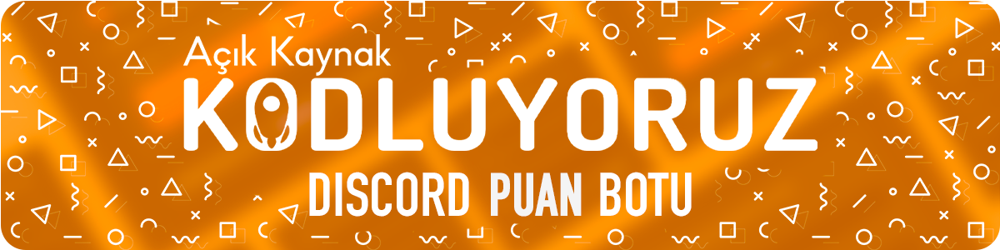
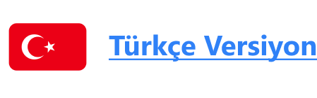

# Kodluyoruz Discord Points Bot

#

#

## About the Project 📜
Kodluyoruz team and Kodluyoruz Open Source volunteers have prepared a Discord points bot that is customizable, user-friendly and creates an automatic scoring system to be used on Discord servers. This scoring system is a tool to track the participation of members in activities on the server, reward active members, and help improve the community experience. It will assist server administrators in streamlining these processes.

## Getting Started 📌

### Requirements

Lorem ipsum, dolor sit amet consectetur adipisicing elit. Officiis quos sit excepturi impedit beatae cum labore explicabo autem, nostrum quasi ab? Nobis et accusantium, ducimus nulla dolorum minima culpa fugit corporis alias nostrum corrupti beatae unde assumenda maiores odio reprehenderit necessitatibus. Voluptas maxime sit perspiciatis, inventore similique blanditiis suscipit. Deserunt.

### Installation

Lorem ipsum, dolor sit amet consectetur adipisicing elit. Officiis quos sit excepturi impedit beatae cum labore explicabo autem, nostrum quasi ab? Nobis et accusantium, ducimus nulla dolorum minima culpa fugit corporis alias nostrum corrupti beatae unde assumenda maiores odio reprehenderit necessitatibus. Voluptas maxime sit perspiciatis, inventore similique blanditiis suscipit. Deserunt.

### Versions

Lorem ipsum, dolor sit amet consectetur adipisicing elit. Officiis quos sit excepturi impedit beatae cum labore explicabo autem, nostrum quasi ab? Nobis et accusantium, ducimus nulla dolorum minima culpa fugit corporis alias nostrum corrupti beatae unde assumenda maiores odio reprehenderit necessitatibus.

(<a href="#readme-top"> back to top </a>)

## Screenshots 📷

(<a href="#readme-top"> back to top </a>)

## Table of Contents 📑

- [Kodluyoruz Discord Points Bot](#kodluyoruz-discord-points-bot)
- 
- 
  - [About the Project 📜](#about-the-project-)
  - [Getting Started 📌](#getting-started-)
    - [Requirements](#requirements)
    - [Installation](#installation)
    - [Versions](#versions)
  - [Screenshots 📷](#screenshots-)
  - [Table of Contents 📑](#table-of-contents-)
  - [Features 🖥️](#features-️)
  - [Contributors 👩‍💻](#contributors-)
  - [Code of Conduct 🎯](#code-of-conduct-)
  - [Contributing 👨‍💻](#contributing-)
  - [License ©](#license-)

(<a href="#readme-top"> back to top </a>)

## Features 🖥️

Lorem ipsum, dolor sit amet consectetur adipisicing elit. Officiis quos sit excepturi impedit beatae cum labore explicabo autem, nostrum quasi ab? Nobis et accusantium, ducimus nulla dolorum minima culpa fugit corporis alias nostrum corrupti beatae unde assumenda maiores odio reprehenderit necessitatibus.

(<a href="#readme-top"> back to top </a>)

## Contributors 👩‍💻
Thank you for contributions. We appreciate everyone who contributes.
<table>
  <tbody>
    <tr>
      <td align="center" valign="top" width="14.28%"><a href="https://github.com/azateser"> <b>Azat Eser</b></a> <a href="aaa" title="Designer">🎨</a></td>
      <td align="center" valign="top" width="14.28%"><a href="https://github.com/WildGenie"> <b>Bilgehan Zeki Özaytaç</b></a>  <a href="aaa" title="Reviewed Pull Requests">👀</a> <a href="aaa" title="Tools">🔧</a> <a href="#question-jakebolam" title="Answering Questions">💬</a> <a href="#maintenance-jakebolam" title="Maintenance">🚧</a></td>
      <td align="center" valign="top" width="14.28%"><a href="https://github.com/cennetgun"> <b>Cennet Gündoğdu</b></a> <a href="aaa" title="Documentation">📖</a><a href="aaa" title="Translation">🌍</a>  </td>
      <td align="center" valign="top" width="14.28%"><a href="https://github.com/denizk1"> <b>Deniz Kaparlar</b></a>  <a href="aaa" title="Code">💻</a> </td>
      <td align="center" valign="top" width="14.28%"><a href="https://github.com/EcenurrKaya"> <b>Ecenur Kaya</b></a> <a href="aaa" title="Documentation">📖</a></td>
      <td align="center" valign="top" width="14.28%"><a href="https://www.behance.net/ekincanakn"> <b>Ekin Can Akın</b></a> <a href="aaa" title="Designer">🎨</a></td>
      <td align="center" valign="top" width="14.28%"><a href="https://github.com/furkanulutas0"> <b>Furkan Ulutaş</b></a> <a href="aaa" title="Documentation">📖</a></td>
    </tr>
    <tr>
      <td align="center" valign="top" width="14.28%"><a href="https://github.com/ismet-k"> <b>İsmet Kabasakal</b></a> <a href="aaa" title="Documentation">📖</a></td>
      <td align="center" valign="top" width="14.28%"><a href="https://github.com/code-a-man"> <b>Metin Arslan</b></a> <a href="aaa" title="Reviewer">👀</a></td>
      <td align="center" valign="top" width="14.28%"><a href="https://github.com/metinbicaksiz"> <b>Metin Bıçaksız</b></a> <a href="aaa" title="Code">💻</a></td>
      <td align="center" valign="top" width="14.28%"><a href="https://github.com/muffafa"> <b>Muhammed Mustafa Savar</b></a>  <a href="aaa" title="Reviewed Pull Requests">👀</a></td>
      <td align="center" valign="top" width="14.28%"><a href="https://github.com/Onur-Morkoc"> <b>Onur Morkoç</b></a> <a href="aaa" title="Reviewer">👀</a></td>
      <td align="center" valign="top" width="14.28%"><a href="https://github.com/oykuparlakk"> <b>Öykü Parlak</b></a> <a href="aaa" title="Code">💻</a></td>
      <td align="center" valign="top" width="14.28%"><a href="https://github.com/selmakoksal"> <b>Selma Köksal</b></a> <a href="aaa" title="Documentation">📖</a></td>
    </tr>
  </tbody>
</table>

(<a href="#readme-top"> back to top </a>)

## Code of Conduct 🎯

To ensure a safe and respectful environment for everyone in this community, we kindly ask you to adhere to the rules in the [CODE_OF_CONDUCT.md](CODE_OF_CONDUCT.md) file.

## Contributing 👨‍💻

If you would like to contribute to the project, please read the [CONTRIBUTING.md](CONTRIBUTING.md) file. This document contains information on how you can contribute to the project, coding and debugging instructions, feedback submission guidelines and other topics.

## License ©

This project is licensed under the [MIT](https://choosealicense.com/licenses/mit/) license. You can find details of this license in the [LICENSE](LICENSE) file.

(<a href="#readme-top"> back to top </a>)

